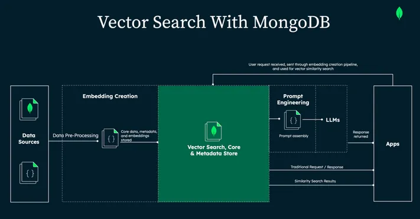

# NewsBiz / Visual Market News — AI-Powered Financial Insights at a Glance

**Built for the AI in Action Hackathon (MongoDB Challenge)**

---
## 📺 Demo Video

## 📌 Overview

**Visual Market News** or  **NewsBiz** is an AI-powered market intelligence tool that turns the overwhelming chaos of financial news into clear, actionable insights.

Rather than sifting through walls of articles, our tool helps you understand the market’s emotional tone, key events, and relevant stocks — in just a glance.

This project combines **MongoDB Vector Search**, **Google Gemini**, and **custom emotional/impact scoring** to deliver rich visual summaries and powerful search capabilities.

---

## 🧩 How It Works

> _Below you'll find architecture diagrams of vector search, embeddings, and RAG-based querying with MongoDB and Gemini._  
> _Also included: example MongoDB document structures._

### 🔍 Search System Flow (Diagram Included)
1. News articles are ingested daily.
2. Each article is:
   - Embedded as a semantic vector.
   - Stored in MongoDB with tone/impact scores.
   
3. When users search:
   - Queries are embedded.
   - Relevant documents are retrieved using **MongoDB Vector Search**.
   - If it's a question (ends in `?`), a **RAG** flow is triggered using Gemini to generate a precise, contextual answer. 
---

## 💡 Features

### 🟩 Visual Market Mood Tree
- Emotionally scores all daily news and displays it as a treemap chart.
- Quickly understand the overall market sentiment (Optimistic, Neutral, Critical, etc.).
- Scores calculated using tone breakdown + article count weighting.

### 🔵 Smart Search with RAG
- Use natural language, terms, or full questions.
- Typo-tolerant, semantically relevant results via **MongoDB Atlas Vector Search**.
- Ask questions like:  
  - “What caused the market drop today?”
  - “Is there any news on Tesla?”
- Questions trigger a **Gemini-powered RAG** response based on top-matched articles.

### 🟠 Impact Score & Emotional Gauge
- Each article includes:
  - **Impact Score (0–100)** — How likely the news is to move the market.
  - **Tone Breakdown** — Optimistic, Critical, Neutral, etc.
- Enables you to prioritize high-impact news instantly.

### 🟣 Relevant Stocks & Recommended Articles
- Detects the most-mentioned stocks from daily articles.
- Recommends semantically related articles with visible impact scores.
- Clickable stock chips link directly to Google for quick research.

---

## 🖼️ UI Previews & Technical Diagrams

📸 UI Screenshots:  
- Home page with mood graph  
- Article detail view  
- Search bar with AI-powered results  
- Recommended articles section  

---

## 🛠️ Tech Stack

| Layer        | Tech                            |
|--------------|----------------------------------|
| Frontend     | React, CSS               |
| Backend      | Node.js, Express                 |
| Database     | MongoDB Atlas + Vector Search    |
| AI           | Google Gemini  + RAG Strategy |
| Embedding    | Gemini Embedding API             |
| Dev Tools    | dotenv, axios, RSS Parser        |

---

## 🚀 Local Setup & Running

> 📁 The project is split into two folders: `frontend/` and `backend/`

### 2. Install Dependencies

`cd backend
npm install 
cd ../frontend
npm install`

### 3. Set up Environment Variables

Create a `.env` file in both `backend/` and `frontend/` (if needed):

**Backend `.env` file:**

env

`GEMINI_API_KEY=your_google_gemini_key
MONGODB_URI=your_mongodb_connection_url`
### 4. Run the App

Terminal 1 - Start backend
cd backend
`node index.js`

#Terminal 2 - Start frontend
cd frontend
`npm start`
## 🌟 Final Note

This project was built with ❤️ for the **AI in Action Hackathon** hosted by **MongoDB** and **Google**.

It’s fast, focused, and built for people who want to _understand_ the market — not get lost in it.

> **Thanks for checking it out!**  
> Feedback, questions, and forks are all welcome.

----------

## 🏷 Tags

`#MongoDB` `#VectorSearch` `#GeminiAI` `#Hackathon` `#RAG` `#Fintech` `#SemanticSearch` `#React` `#Node`

